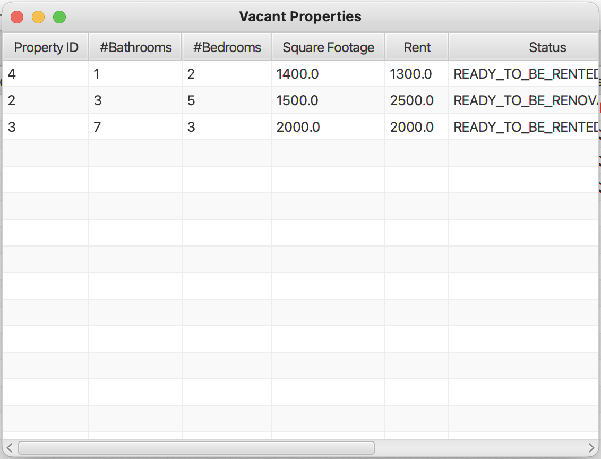

# Advanced Programming Practices

### Course Project

The task to develop a piece of software to manage the rental units of a real estate
company. The company owns apartment buildings, condos and houses. All of them are for residential
occupancy only. An apartment building has one civic address and many apartments inside it. Each
apartment is identified by an apartment number. Each apartment has a number of bedrooms, a number
of bathrooms, and square footage. The condo is a privately owned apartment in a high end building. A
condo has a street number in addition to the unit number. A house has a street number and no unit
number. The other normal fields of address apply to all of them (street name, city, postal code, etc..).

When a potential tenant is interested in a specific rental unit and that rental unit is occupied, the system
allows the tenant to register in the system indicating which unit he or she is interested in. Once the
company knows that this unit will become available, an e-mail is sent to all potential tenants interested
in that unit.

You need to create a centralized accounting system to be used by the company’s administration and
also the existing tenants. The accounting system should keep track of who has paid the rent and who
has not.

Team:
| Name | Student ID |
|--- |--- |
| [Mayurkumar K Jodhani](https://github.com/mkjodhani) | 40230634 |
| [Dharmil M Vaghasiya](https://github.com/dharmil3675) | 40230633 |
| [Snehee V Patel](https://github.com/Snehee2901) | 40231497 |

Class Diagram:

## Preview:

### GUI Interface:

  
  

  
  

  
  

  
  

  
  

  
  

  
  

  
  

  
  

  
  

  
  

  
  

  
  

  
  

  
  

  
  

  
  

  
  

  
  

